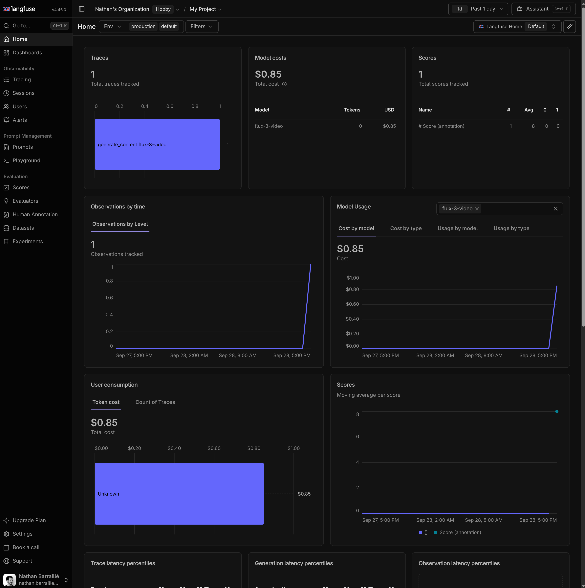
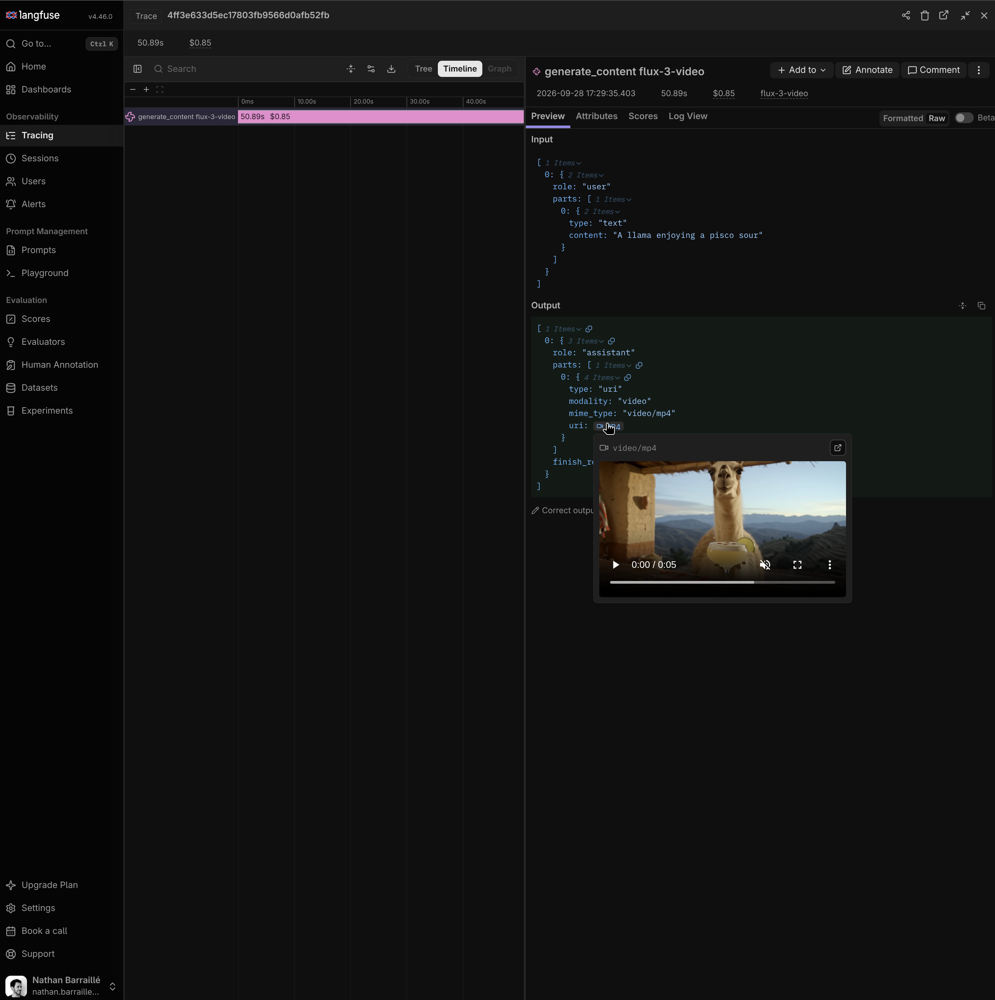

# BFL DevExp

## Disclaimer

In this document, I tried to perform research to explain my reasoning about how I would prioritize and choose what to build and what not. Since this was a weekend project and I didn't have any data available, the research was done quickly and most conclusions are based on intuition and might not be accurate.

## Distribution Channels

There are 4 ways for developers to integrate with BFL and video models:

| Channel | Pros | Cons |
|---|---|---|
| **Direct API/SDK** | Access to all model features, Volume Pricing | Cannot switch provider |
| **Dev tools SDK** (Vercel AI SDK, LiteLLM) | Single SDK for all models | Limited features |
| **Gateway Platform** (fal, Replicate, Vercel AI Gateway) | One key and one bill for all providers, almost all features | Intermediary, more expensive on large volumes |
| **Self-hosted Gateway** (LiteLLM proxy) | Centralized LLM management, governance, telemetry, volume pricing | Complex setup and infra |

From BFL's standpoint, direct API/SDK access is preferred, since it makes it harder for people to migrate to another provider. We need to incentivize developers to use our models via direct channels.

I see 3 mechanisms to do so:
- Pricing: Cheaper generation for direct access. This is already the case for Gateway Platforms, so it is hard to push further.
- Limit model options via platforms, make it only for trial (ie, 10 seconds max, no 4K, no draft/enhance...). Risky, since the path with the least friction for users is to switch provider.
- Differentiating SDK features. Beating dev tools / platform SDK on pure DevExp is hard, because this is their core product

## Developer personas

To improve developer experience, we first need to understand who the developers are, and what they need.
I distinguish 4 types.

| Persona | Features they need | Best channel for them | Potential revenue |
|---|---|---|---|
| **Startup devs** | SDK, Webhooks, draft preview and enhance, telemetry, sandbox | Platform (fal or Replicate, Vercel AI Gateway), dev tool or SDK | *** |
| **Platform teams at bigger companies** (> 50 devs) | Telemetry, spend-management, governance, data volume contracts. | LiteLLM proxy, cloud marketplaces (Azure AI Foundry) | ***** |
| **Creatives** (designers, creators, agencies) | Visual interface, keyframes control, draft preview and enhance, 4K | ComfyUI, Photoshop | *** |
| **Hobbyists and solo devs** | Fast setup, cost preview, file uploads, agents integration | Platform, dev tool or SDK | * |

## Developer tool integration: LiteLLM

Disclaimer: I spent less time on this assignment and the full PR is vibe-coded

**Why LiteLLM.** Platform teams at larger companies run LiteLLM as their self-hosted gateway to every model (60k GitHub stars, about 88M PyPI downloads a month). It added video generation in Oct 2025, but it can't run BFL video. Its default video model is still OpenAI's `sora-2`, which shut down on 2026-09-24. Adding FLUX 3, and proposing it as the new default, reaches our biggest-revenue persona where they already work.

**What fails today**
- LiteLLM 1.103.0, the latest release, rejects FLUX 3 video: `video generation is not supported for black_forest_labs`. It rejects FLUX.2 image models too.
- BFL's open PR [#37224](https://github.com/BerriAI/litellm/pull/37224) adds FLUX 3 video. It has been open since 2026-08-17 with no maintainer review. Two problems:
  - A 4K request (`size="3840x2160"`) reaches BFL as `fhd` (1080p), because the PR only knows `hd` and `fhd`.
  - LiteLLM logs **$0.00** for every video, because the clip length never reaches its cost code. Its single $0.17/s price would be wrong anyway: 4K costs $0.80/s.

**My change** is one commit (8 files) on top of the PR, in my fork: [compare view](https://github.com/nat-e/litellm/compare/flux3-pr...flux3-qhd-uhd).
- Accepts `qhd` and `uhd`, and maps `size` to BFL's tiers by pixel count, using BFL's size table.
- Prices each mode (t2v/i2v, v2v, drafts) and each resolution from BFL's price list, using the same mechanism LiteLLM already uses for Veo.
- Adds 20 tests. All 124 BFL tests pass.

**Before / after.** Request: 4K, 5 s, text-to-video.

| | Sent to BFL | BFL bills | LiteLLM logs |
|---|---|---|---|
| LiteLLM 1.103.0 | fails: not supported | — | — |
| PR as-is | `fhd` | $1.45 | $0.00 |
| PR + my change | `uhd` | $4.00 | $4.00 |

**Not fixed yet:**
- `9:21` is still missing.
- A request with no duration (BFL's default, `auto`) still logs $0.
- Draft-enhance has no public price, so I priced it like a full render at its resolution.

## Platform memo: fal

fal ships every FLUX 3 mode on launch day, at exactly BFL's price per second, so it is where many developers and agents meet FLUX 3.

The short version: on fal, FLUX 3 is **hard to find** for agents and **behind** our API on options. It also comes with things our own API lacks: webhooks, outputs kept for 7 days, cancel, file uploads and 5 free drafts a day.

### 1. What we should push fal to change

1. **List FLUX 3 in fal's docs for agents.** Agents are told to "pick an endpoint ID below", so they never pick FLUX 3.
   - [fal.ai/llms.txt](https://fal.ai/llms.txt) only lists Veo 3.1, Kling 3 and Seedance under "Video generation".
   - [llms-full.txt](https://fal.ai/docs/llms-full.txt) (3.8 MB) doesn't mention `flux-3` once.
2. **Ship our option changes.** New endpoints land on fal the same day (drafts on 08-04, upscale on 08-20), but changes to existing ones never do.
   - fal's [text-to-video](https://fal.ai/api/openapi/queue/openapi.json?endpoint_id=blackforestlabs/flux-3/text-to-video) only takes `720p`/`1080p`. [Ours](https://api.bfl.ai/openapi.json) has had `qhd`/`uhd` since 2026-09-10.
   - `9:21` and `user` are missing too.
   - Draft-enhance has no resolution option, so it's always 1080p.

### 2. What we should change on our side

1. **Webhooks on FLUX 3 video.** Same price, but fal has [webhooks](https://fal.ai/docs/documentation/model-apis/inference/webhooks) and we don't. As shown in the SDK section, polling is the biggest pain point of using BFL today.

### 3. What we should not do

- **Don't keep features like 2K/4K off fal to push developers to our API.** This is too risky. A developer on fal who needs 4K will not move to our API; they will pick Kling, which offers 4K on fal. FLUX 3 is already only 18th in fal's text-to-video list.
- **Ignore fal problems that are not about FLUX.** Examples: the server proxy defaults that let anyone run any model on the developer's key, polling every 500 ms, 4 different error shapes, and a 401 that names the internal app `fal-ai/flux-3`. Report them once, then don't track them.

### Monday morning

1. Send fal the `llms.txt` change and the FLUX 3 doc fixes.
2. Send fal the list of missing options and build a relationship to anticipate upcoming changes.

## SDK decisions

### Who it's for

**Startup developers** who add video generation to their product. They bring more revenue than hobbyists (see the personas table).

The journey: a user types a prompt, and the app shows the video. I picked two common stacks:
- Supabase + React SPA on Cloudflare Pages (the Lovable stack)
- Next.js on Vercel (the most popular YC stack)

### Language: TypeScript

It covers the stacks startups use:
- SSR frameworks (Next.js, SvelteKit, Nuxt)
- SPA + Node backend (Hono, Fastify, Express, ...)
- SPA + edge functions (Vercel, Supabase).

Both fal and Replicate get more installs from JS than from Python.

The POC runs on Node (Vercel) and Deno (Supabase Edge Functions). Bun and Cloudflare Workers would come next.

### What I built

`bfl.videos.fromText()` creates and submits a text-to-video job. The app saves it, then calls `check()` from any process (cron, Edge Function, workflow), or `wait()` in a script.

On top of that, two things the raw API does not do:

1. **One trace per video.** Each job becomes one OpenTelemetry span, from submit to finish, even when those happen in different processes. It uses the standard `gen_ai.*` attributes: model, settings, cost in USD, user id and errors. The SDK writes through the app's own OpenTelemetry setup, and does nothing if there is none. The Vercel AI SDK already supports FLUX 3 video, but its video calls have no tracing.
2. **Errors you can act on.** Each `BflError` has a `code`, a `retryable` flag ("calling again later may work") and a message that says what to do, for developers and for agents. Moderation and failed generations come back as a `failed` job with reasons, not as exceptions, so the app saves them like any other result.

With [Langfuse](https://langfuse.com), the app only adds `LangfuseSpanProcessor` to its setup (see [instrumentation.ts](examples/vercel_next/instrumentation.ts)) and gets cost and latency dashboards for FLUX 3 video:

With `telemetry: { recordContent: true }`, the span also holds the prompt and the video link, for annotations and evaluations:

Two example apps use the SDK on the stacks above: [Supabase + React](examples/supabase_react) and [Next.js + Vercel Workflows](examples/vercel_next). A [Node script](examples/node_script) shows the hooks. They are vibe coded: judge the SDK, not the example code.

### The contract

- **Exposed:** `bfl.videos` with ability to submit text-to-video jobs, check and wait for them, and a job with three states: `in_progress`, `ready`, `failed`. A modular hook system for event-driven usage of the SDK.
- **Hidden:** the check that the polling URL points to a BFL host, BFL's raw status names (kept as `processingStatus`), and FastAPI's raw error lists.
- **Defaults:** the SDK sets no API field. BFL owns the defaults, so they live in one place and can't drift. OpenAI, Stripe, Google and Resend do the same. The model has no default either, so an SDK upgrade never switches your model. The SDK only sets its own settings: 30 s per request, 5 s between `wait()` checks, prompts potentially containing PII left out of traces.

### When the API grows

The SDK must not block new features or break on new values:
- `extra` sends any new field straight to the API, before the SDK has a type for it.
- `version` picks a new model version without an SDK release.
- An unknown status counts as still running. Nothing crashes.
- A new model is one class in [models](src/resources/videos/models), plus its id in `VideoModelId` and one line in the [model table](src/resources/videos.ts).
- The SDK has no defaults and no price table, so nothing goes stale when BFL changes them.

### What I refused to build

- **Browser support:** it invites putting the API key in the page.
- **Storage and polling adapters** (Supabase Storage, Vercel Blob, a polling Worker): too much to maintain. They belong in cookbooks, examples and blog posts.
- **Video editing helpers** (crop, resize, ...): existing libraries do this well.
- **Direct video upload:** the 50 MB cap makes it a dead end.

### Where my contract disagrees with BFL's

| BFL API today | What the SDK does | What I'd change in the API |
|---|---|---|
| Returns a `polling_url` tied to one region | Keeps the whole job as JSON so any process can check it | `GET /v1/videos/{id}` on any host |
| Bad key: 422 "Invalid API key format", or 403 | Maps both to `invalid_api_key` by matching the message text (brittle) | Always 403, with an error code |
| Unknown job: 404, missing from the spec | Follows the real behavior: `job_not_found` | Document the 404 |
| No webhooks on video; links expire after about 1h | `check()` for cron and workflows, `wait()` for scripts; docs say to copy the file | Webhooks, plus longer storage as a paid option |
| No idempotency key, no way to list jobs | A submit that times out is `retryable`, but BFL may already have charged it | Idempotency keys and a job list |

The features that would help developers most need API changes, so they are not in the SDK: webhooks, idempotency keys, a cost preview before submit, a sandbox with fixed outputs (like Stripe test mode), and drafts without a binary bundle.

### Left rough on purpose

- Text-to-video only: no image-to-video, video-to-video, draft → enhance, images or tools.
- Node and Deno only.
- The double-charge risk above: the fix belongs in the API, not in SDK workarounds.
- End to end tracing requires serialization and storage of the full Job object. Once again, the clean path belongs in the API (make the polling endpoint return the input of a job and its start date). Developers should just be saving a JobId and retrieve everything else from the API.
- API error parsing. There is no clear schema definition in the API documentation.

### Where I overrode the AI

I wrote the SDK structure by hand. AI is bad at module boundaries and at keeping complexity down.

I used AI extensively for research, based on popular SDKs with good DX (Stripe, OpenAI, Vercel, Supabase, Resend).
I also used it for implementing well scoped parts, tests, examples and for help writing this document.

Here are specific examples of where I had to do it myself / correct it:
- Forced it to use OOP constructs rather than purely functional style
- Fixed design and use of Typescript generics, rather than use of unknown and casts
- Clean separation of concern between the modules (telemetry and resources, via hooks)
- Clean abstractions of Resources (videos/images) and models (flux3/future models)

